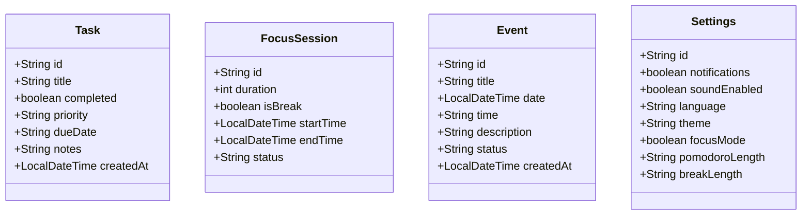

# Breeze Flow - Projektdokumentation

## Inhaltsverzeichnis
1. [Projektidee](#projektidee)
2. [Anforderungskatalog](#anforderungskatalog)
3. [Klassendiagramm](#klassendiagramm)
4. [Storyboard](#storyboard)
5. [Screen-Mockups](#screen-mockups)
6. [REST-Schnittstellen](#rest-schnittstellen)
7. [Testplan](#testplan)
8. [Installationsanleitung](#installationsanleitung)
9. [Hilfestellungen](#hilfestellungen)

## Projektidee
Breeze Flow ist eine moderne Produktivitäts- und Aufgabenverwaltungsanwendung, die entwickelt wurde, um Benutzern zu helfen, ihre Arbeit effizienter zu organisieren und ihre Konzentration zu verbessern. Die Anwendung kombiniert Aufgabenverwaltung, Fokus-Timer und Kalenderfunktionen in einer intuitiven Benutzeroberfläche.

### Kernfunktionen
- **Aufgabenverwaltung**: Intelligente Organisation und Priorisierung von Aufgaben
- **Fokus-Sessions**: Pomodoro-basierte Zeiteinteilung für maximale Produktivität
- **Kalenderintegration**: Nahtlose Terminplanung und Ereignisverwaltung
- **Personalisierung**: Anpassbare Einstellungen für individuelle Arbeitsstile

## Anforderungskatalog

### 1. Aufgabenverwaltung
- [x] CRUD-Operationen für Aufgaben
- [x] Prioritätssetzung (hoch, mittel, niedrig)
- [x] Fälligkeitsdaten und Erinnerungen
- [x] Kategorisierung durch Tags
- [x] Fortschrittsverfolgung

### 2. Fokus-Timer
- [x] Konfigurierbare Pomodoro-Intervalle
- [x] Automatische Pausenverwaltung
- [x] Statistikerfassung
- [x] Benachrichtigungen
- [x] Session-Tracking

### 3. Kalendersystem
- [x] Ereignisverwaltung
- [x] Terminplanung
- [x] Verschiedene Ansichten (Tag, Woche, Monat)
- [x] Erinnerungsfunktion

### 4. Benutzeroberfläche
- [x] Responsives Design
- [x] Dark/Light Mode
- [x] Intuitive Navigation
- [x] Barrierefreiheit

## Klassendiagramm

### Backend-Modelle


## REST-Schnittstellen

### Aufgaben-API
```
POST /api/tasks
- Erstellt neue Aufgabe
- Body: {title, priority, dueDate, notes}

GET /api/tasks
- Ruft alle Aufgaben ab

PUT /api/tasks/{id}
- Aktualisiert Aufgabe
- Body: {title, completed, priority, dueDate, notes}

DELETE /api/tasks/{id}
- Löscht Aufgabe
```

### Fokus-Session-API
```
POST /api/focus-sessions
- Startet neue Fokus-Session
- Body: {duration, isBreak}

GET /api/focus-sessions
- Ruft alle Sessions ab

PUT /api/focus-sessions/{id}
- Aktualisiert Session-Status
- Body: {status, endTime}
```

### Kalender-API
```
POST /api/events
- Erstellt neues Ereignis
- Body: {title, date, time, description}

GET /api/events
- Ruft alle Ereignisse ab

PUT /api/events/{id}
- Aktualisiert Ereignis
- Body: {title, date, time, description, status}

DELETE /api/events/{id}
- Löscht Ereignis
```

## Testplan

### 1. Unit Tests
- [x] Modell-Validierung
- [x] Repository-Funktionen
- [x] Service-Logik

### 2. Integrationstests
- [x] API-Endpunkte
- [x] Datenbank-Operationen
- [x] Frontend-Backend-Kommunikation

### 3. UI/UX Tests
- [x] Responsive Design
- [x] Browserkompatibilität
- [x] Benutzerfreundlichkeit

## Installationsanleitung

### Backend (Spring Boot)
1. Voraussetzungen:
   - Java 21
   - Maven
   - MongoDB

2. Installation:
```bash
git clone https://github.com/YOUR_USERNAME/Breeze-Flow.git
cd Breeze-Flow-Backend
mvn clean install
mvn spring-boot:run
```

### Frontend (React + Vite)
1. Voraussetzungen:
   - Node.js
   - npm/yarn

2. Installation:
```bash
cd Breeze-Flow-Frontend
npm install
npm run dev
```

### Konfiguration
1. MongoDB:
   - Standard-Port: 27017
   - Datenbank: breeze_flow

2. Anwendung:
   - Backend: http://localhost:8080
   - Frontend: http://localhost:5173

## Hilfestellungen

### Verwendete Technologien
- **Backend**: Spring Boot, MongoDB
- **Frontend**: React, Chakra UI, Vite
- **Entwicklungstools**: Maven, Git

### Dokumentation & Ressourcen
- Spring Boot: https://spring.io/projects/spring-boot
- React: https://reactjs.org/
- MongoDB: https://www.mongodb.com/docs/

### Entwicklungsrichtlinien
1. Code-Formatierung: Standard Java/JavaScript Style Guide
2. Commit-Nachrichten: Conventional Commits
3. Dokumentation: JavaDoc für Backend, JSDoc für Frontend